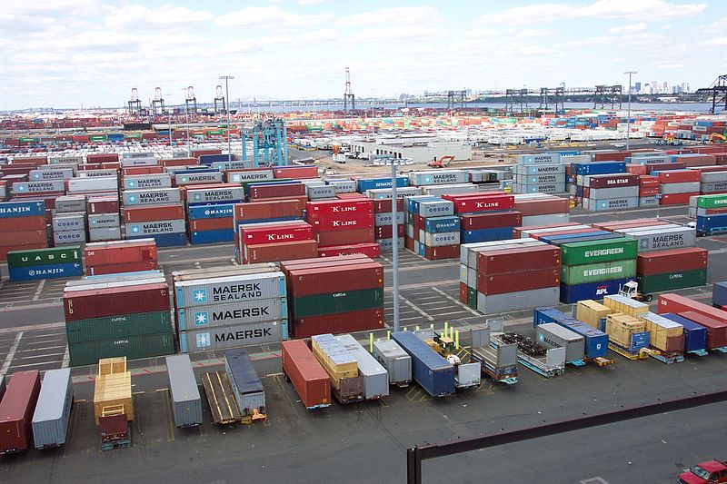

Containers
==========

What you find here is a programming exercise in Swift, the coolest new language in town.

The purpose of this exercise is to learn how some of the eXtreme Programming practices translate to Swift. We'll be using tools like [Quick and Nimble][1] and you'll learn how to overcome certain Swift challenges such as using C libraries in Swift. 

You'll need a Mac with [Xcode 7.0.1][2].

Preparations
------------

Start by forking this repository and cloning it to your Mac. 

Make sure that you open the .xcworkspace file with Xcode, because if you just open the .xcodeproj file instead you'll miss some dependencies.

Run the tests (keyboard shortcut: ⌘U), and see that you have one succeeding test.

The exercise
-------------
You have just been hired by a small container port to create software for their latest automatic crane. The crane comes with a state-of-the-art C interface that allows you to raise and lower shipping containers. You can find it in the `Crane.c` file. Every container has a unique id that must be passed to the crane when raising or lowering that container.

The software that you write is responsible for maintaining a stack of shipping containers. It ought to be able to:

* raise a container on top of the stack
* lower a container from the top of the stack
* inspect whether a stack is empty or not

You'll work by first creating a test and making sure it fails. Next you'll implement the least amount of code to make the test pass. Then you refactor until you do not know how to improve the code any more. And only then are you allowed to create the next test. In other words, you'll be practising the art of Test Driven Development.

Make sure that during this exercise you commit early and often. Making small commits will help you backtrack in case something goes awry, and helps you to analyse what you did later on.

The challenge
-------------

When you've completed the exercise above, we have an additional challenge for you. Three shipping companies have supplied Swift classes to represent their shipping containers. Your job is to ensure that shipping containers for all three shipping containers can be stacked.

Unfortunately these companies couldn't agree on a common base class, so you'll have to find a way to deal with that. Preferably without using typecasts. Oh, and you're not allowed to change the shipping container classes.

You can find the shipping container classes in `ContainerBrands.swift` file in the `brands` branch of this repository. 

Advanced challenge
------------------

If that was not enough for you, we have more! There is also a Fast Crane that was implemented in Objective-C. This will give you whole new worlds of pain. Your assignment is to implement the classes in the branch `fast_crane`, specifically `FastCrane.m` and `Container.swift`. Of course you need to do this in a test-driven fashion as well.

Wrap-up
-------

We hope that you enjoyed this exercise. Feel free to share your experience [at our wiki][4].

[Mark][5] & [Stefan][6]

[1]: https://github.com/Quick/Quick
[2]: https://developer.apple.com/xcode/
[3]: https://github.com/Quick/Quick/blob/master/Documentation/QuickExamplesAndGroups.md
[4]: https://github.com/markspanbroek/Containers/wiki
[5]: https://github.com/markspanbroek
[6]: https://github.com/svdo